### Escuela Colombiana de Ingeniería
### Arquitecturas de Software - ARSW

## Escalamiento en Azure con Maquinas Virtuales, Sacale Sets y Service Plans

### Dependencias
* Cree una cuenta gratuita dentro de Azure. Para hacerlo puede guiarse de esta [documentación](https://azure.microsoft.com/es-es/free/students/). Al hacerlo usted contará con $100 USD para gastar durante 12 meses.

### Parte 0 - Entendiendo el escenario de calidad

Adjunto a este laboratorio usted podrá encontrar una aplicación totalmente desarrollada que tiene como objetivo calcular el enésimo valor de la secuencia de Fibonnaci.

**Escalabilidad**
Cuando un conjunto de usuarios consulta un enésimo número (superior a 1000000) de la secuencia de Fibonacci de forma concurrente y el sistema se encuentra bajo condiciones normales de operación, todas las peticiones deben ser respondidas y el consumo de CPU del sistema no puede superar el 70%.

### Parte 1 - Escalabilidad vertical

1. Diríjase a el [Portal de Azure](https://portal.azure.com/) y a continuación cree una maquina virtual con las características básicas descritas en la imágen 1 y que corresponden a las siguientes:
    * Resource Group = SCALABILITY_LAB
    * Virtual machine name = VERTICAL-SCALABILITY
    * Image = Ubuntu Server 
    * Size = Standard B1ls
    * Username = scalability_lab
    * SSH publi key = Su llave ssh publica


2. Para conectarse a la VM use el siguiente comando, donde las `x` las debe remplazar por la IP de su propia VM (Revise la sección "Connect" de la virtual machine creada para tener una guía más detallada).

    `ssh scalability_lab@xxx.xxx.xxx.xxx`

3. Instale node, para ello siga la sección *Installing Node.js and npm using NVM* que encontrará en este [enlace](https://linuxize.com/post/how-to-install-node-js-on-ubuntu-18.04/).
4. Para instalar la aplicación adjunta al Laboratorio, suba la carpeta `FibonacciApp` a un repositorio al cual tenga acceso y ejecute estos comandos dentro de la VM:

    `git clone <your_repo>`

    `cd <your_repo>/FibonacciApp`

    `npm install`

5. Para ejecutar la aplicación puede usar el comando `npm FibinacciApp.js`, sin embargo una vez pierda la conexión ssh la aplicación dejará de funcionar. Para evitar ese compartamiento usaremos *forever*. Ejecute los siguientes comando dentro de la VM.

    ` node FibonacciApp.js`

6. Antes de verificar si el endpoint funciona, en Azure vaya a la sección de *Networking* y cree una *Inbound port rule* tal como se muestra en la imágen. Para verificar que la aplicación funciona, use un browser y user el endpoint `http://xxx.xxx.xxx.xxx:3000/fibonacci/6`. La respuesta debe ser `The answer is 8`.


7. La función que calcula en enésimo número de la secuencia de Fibonacci está muy mal construido y consume bastante CPU para obtener la respuesta. Usando la consola del Browser documente los tiempos de respuesta para dicho endpoint usando los siguintes valores:
* 1000000
   
    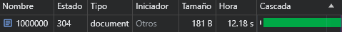

* 1010000
   
    

* 1020000
      
    
    
* 1030000
    
    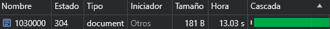
   
* 1040000
       
    
     
* 1050000
          
    
        
* 1060000
             
    

* 1070000
* 
    
              
* 1080000
   
    
                 
* 1090000    
   
    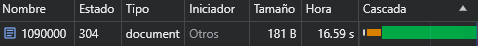

8. Dírijase ahora a Azure y verifique el consumo de CPU para la VM. (Los resultados pueden tardar 5 minutos en aparecer).


9. Ahora usaremos Postman para simular una carga concurrente a nuestro sistema. Siga estos pasos.
    * Instale newman con el comando `npm install newman -g`. Para conocer más de Newman consulte el siguiente [enlace](https://learning.getpostman.com/docs/postman/collection-runs/command-line-integration-with-newman/).
    * Diríjase hasta la ruta `FibonacciApp/postman` en una maquina diferente a la VM.
    * Para el archivo `[ARSW_LOAD-BALANCING_AZURE].postman_environment.json` cambie el valor del parámetro `VM1` para que coincida con la IP de su VM.
    * Ejecute el siguiente comando.

    ```
    newman run ARSW_LOAD-BALANCING_AZURE.postman_collection.json -e [ARSW_LOAD-BALANCING_AZURE].postman_environment.json -n 10 &
    newman run ARSW_LOAD-BALANCING_AZURE.postman_collection.json -e [ARSW_LOAD-BALANCING_AZURE].postman_environment.json -n 10
    ```

10. La cantidad de CPU consumida es bastante grande y un conjunto considerable de peticiones concurrentes pueden hacer fallar nuestro servicio. Para solucionarlo usaremos una estrategia de Escalamiento Vertical. En Azure diríjase a la sección *size* y a continuación seleccione el tamaño `B2ms`.


11. Una vez el cambio se vea reflejado, repita el paso 7, 8 y 9.

* 1000000

  

* 1010000

  

* 1020000

  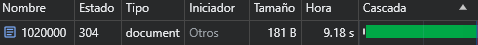

* 1030000

  

* 1040000

  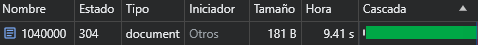

* 1050000

  

* 1060000

  

* 1070000

  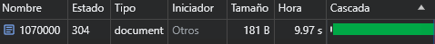

* 1080000

  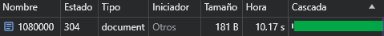

* 1090000

  

12. Evalue el escenario de calidad asociado al requerimiento no funcional de escalabilidad y concluya si usando este modelo de escalabilidad logramos cumplirlo.
13. Vuelva a dejar la VM en el tamaño inicial para evitar cobros adicionales.

**Preguntas**

1. ¿Cuántos y cuáles recursos crea Azure junto con la VM?

Se crean 7 recursos los cuales son:

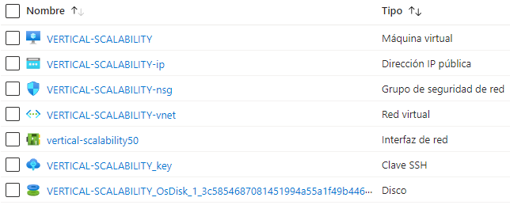

2. ¿Brevemente describa para qué sirve cada recurso?

- **Máquina virtual:** Instancia de un sistema operativo que se ejecuta en la nube. Puede ser Windows o Linux y proporciona recursos informáticos, como CPU, memoria, almacenamiento y red, de manera virtualizada.  Las máquinas virtuales se pueden utilizar para ejecutar una variedad de aplicaciones y servicios, como sitios web, aplicaciones empresariales, bases de datos y análisis.
- **Dirección IP pública:** Es una dirección IP única y accesible públicamente asignada a recursos como máquinas virtuales. Las direcciones IP públicas se utilizan para identificar dispositivos en Internet y permitir que se comuniquen entre sí.
- **Grupo de seguridad de red:** Es un conjunto de reglas que controla el tráfico de red hacia y desde los recursos en una red virtual. Define reglas de filtrado de red que permiten o deniegan el tráfico basándose en la dirección IP, el puerto y el protocolo.
- **Red virtual:** Es una red privada que se ejecuta en la nube. Las redes virtuales se utilizan para aislar los recursos de la nube y proporcionar seguridad.
- **Interfaz de red:** Es un componente que conecta una máquina virtual a una red virtual. Contiene configuraciones de red, como direcciones IP y reglas de seguridad, y actúa como punto de conexión para la comunicación de red.
- **Clave SSH:** Es una clave de cifrado que se utiliza para autenticar a los usuarios de SSH. SSH es un protocolo de red seguro que se utiliza para conectarse a máquinas virtuales y otros dispositivos.
- **Disco:** Es un dispositivo de almacenamiento que se utiliza para almacenar datos. Los discos se pueden utilizar para almacenar datos de máquinas virtuales, aplicaciones y otros recursos de la nube.

3. ¿Al cerrar la conexión ssh con la VM, por qué se cae la aplicación que ejecutamos con el comando `npm FibonacciApp.js`? ¿Por qué debemos crear un *Inbound port rule* antes de acceder al servicio?

* Al cerrar la conexión SSH, se cierra la sesión SSH, que es el proceso que inicia la ejecución de la aplicación. Todos los procesos que se ejecutan como hijos de este proceso también se cierran, lo que incluye a la aplicación FibonacciApp.js.
* Un Inbound port rule es una regla que permite que el tráfico de la red llegue a un puerto específico de la máquina virtual. En este caso, el puerto que debemos abrir es el 3000, ya que es el puerto en el que la aplicación FibonacciApp.js está escuchando.
El Inbound port rule es necesario para que los clientes puedan acceder a la aplicación FibonacciApp.js. Sin este regla, el tráfico de la red será bloqueado por el firewall de la máquina virtual.

6. Adjunte tabla de tiempos e interprete por qué la función tarda tanto tiempo.

| Número de la secuencia de<br/>Fibonacci | Tiempo (s) B1ls | Tiempo (s) B2ms |
|-----------------------------------------|-----------------|-----------------|
| 1000000                                 | 12.18           | 8.86            |
| 1010000                                 | 12.46           | 8.92            |
| 1020000                                 | 12.55           | 9.18            |
| 1030000                                 | 13.03           | 9.32            |
| 1040000                                 | 13.21           | 9.41            |
| 1050000                                 | 13.49           | 9.56            |
| 1060000                                 | 13.80           | 9.69            |
| 1070000                                 | 14.10           | 9.97            |
| 1080000                                 | 15.46           | 10.17           |
| 1090000                                 | 16.59           | 10.36           |

La función tarda mucho tiempo en calcular los números de Fibonacci porque utiliza un método iterativo. Este método consiste en calcular cada número de Fibonacci a partir de los dos anteriores. Por ejemplo, para calcular el número 1000000, la función debe calcular primero los números 999999, 999998, ..., 0. Esto significa que la función debe realizar muchas operaciones matemáticas, lo que lleva tiempo.

5. Adjunte imágen del consumo de CPU de la VM e interprete por qué la función consume esa cantidad de CPU.

* Tamaños B1ls


* Tamaños B2ms

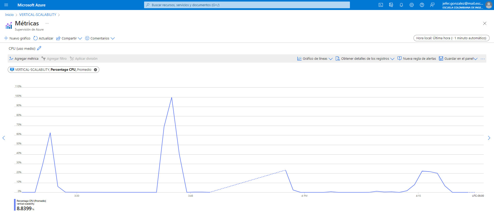

El consumo de CPU de la función Fibonacci se debe a que el algoritmo se ejecuta de manera recursiva. Esto significa que la función se llama a sí misma repetidamente, lo que genera una gran cantidad de llamadas a la CPU.
En el caso específico de la implementación de la función Fibonacci que se está utilizando, no se utiliza ninguna técnica de optimización para reducir el consumo de CPU. Esto significa que la función se ejecuta de manera completamente secuencial, sin que se aprovechen los recursos del procesador de manera eficiente.

7. Adjunte la imagen del resumen de la ejecución de Postman. 

* Tamaños B1ls

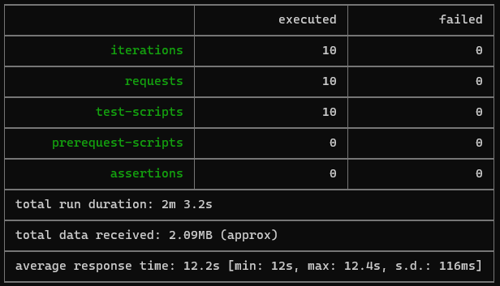

* Tamaños B2ms


Interprete:
* Tiempos de ejecución de cada petición.

    El tiempo de ejecución total usando el tamaño B1ls es de 2m 3.2s, en el cual el promedio de respuesta para cada petición fue de 12.2s. Al cambiar el tamaño a B2ms se reduce el tiempo de ejecución total a 1m 35.s y el tiempo de respuesta promedio para las peticiones fue de 10.3s.

* Si hubo fallos documentelos y explique.

    


    Cuando se cambio al tamaño B2ms se presentaron errores (Error ECONNRESET: El servidor cerró la conexión de una manera que probablemente no era normal), estos fallos se deben a que se genera una alta concurrencia en las peticiones, lo que provoca que la VM no pueda responder a todas las solicitudes a tiempo.


8. ¿Cuál es la diferencia entre los tamaños `B2ms` y `B1ls` (no solo busque especificaciones de infraestructura)?

    La diferencia entre los tamaños B2ms y B1ls radica en sus especificaciones de infraestructura, pero también en otros aspectos que son importantes a tener en cuenta, como la escalabilidad, el rendimiento y la disponibilidad.
    
    **Especificaciones de infraestructura**

    

    **Escalabilidad:** El B2ms tiene una mayor capacidad de escalabilidad que el B1ls. Esto significa que puede manejar mayores volúmenes de datos y procesamiento más intensivo. 
    
    **Rendimiento:** El B2ms también tiene un rendimiento superior al B1ls. Esto significa que puede ejecutar tareas de manera más rápida y eficiente.
    
    **Disponibilidad:** El B1ls es más barato que el B2ms, pero también tiene una menor disponibilidad. Esto significa que es más probable que experimente tiempos de inactividad o errores.

9. ¿Aumentar el tamaño de la VM es una buena solución en este escenario?, ¿Qué pasa con la FibonacciApp cuando cambiamos el tamaño de la VM?

   Aumentar el tamaño de la VM no es una buena solución para mejorar el tiempo de respuesta de la aplicación FibonacciApp.js, ya que la aplicación no está optimizada para aprovechar los recursos de una VM de mayor tamaño. Para mejorar el tiempo de respuesta, se debe optimizar el código de la aplicación para que se ejecute en paralelo o para que utilice una estructura de datos más eficiente.

10. ¿Qué pasa con la infraestructura cuando cambia el tamaño de la VM? ¿Qué efectos negativos implica?

    Cuando se cambia el tamaño de una máquina virtual, esta se reinicia. Esto implica que la aplicación que se ejecuta en la máquina se detiene temporalmente, lo que puede provocar una pérdida de disponibilidad. Además, al reiniciar la máquina, se debe volver a iniciar el servicio que se ejecuta en ella.

10. ¿Hubo mejora en el consumo de CPU o en los tiempos de respuesta? Si/No ¿Por qué?

    Si hubo mejora en el consumo de CPU, cuando se tenía el tamaño de B1ls llego hasta un consumo de 40%, mientras que con el tamaño B2ms llegó hasta un poco mas de 20%.
    En los tiempos de respuesta también hubo una disminución se pasó de un tiempo de respuesta promedio de las peticiones de 12.2s a 10.3s.
    Estas mejoras se deben a que las máquinas con mayor tamaño tienen más recursos de procesamiento, lo que permite que las aplicaciones soporten más cálculos y conexiones.

11. Aumente la cantidad de ejecuciones paralelas del comando de postman a `4`. ¿El comportamiento del sistema es porcentualmente mejor?

    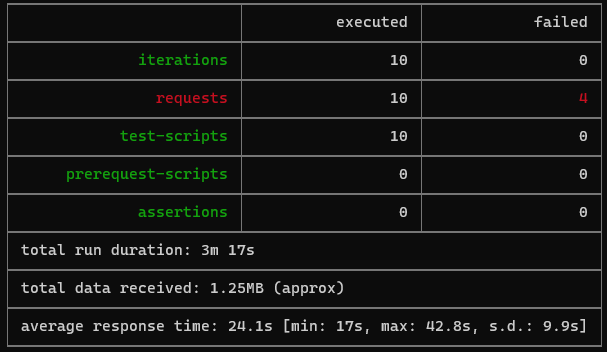

  Al cambiar la cantidad de ejecuciones paralelas del comando de postman a `4` no se obtuvo mejoras en el sistema, ya que se aumentó el tiempo promedio de respuesta de 10.3s a 24.1s y el tiempo total pasó de 1m 35.1s a 3m 17s. Además, se obtuvieron la misma cantidad de fallos al realizar la prueba de carga con newman. 

### Parte 2 - Escalabilidad horizontal

#### Crear el Balanceador de Carga

Antes de continuar puede eliminar el grupo de recursos anterior para evitar gastos adicionales y realizar la actividad en un grupo de recursos totalmente limpio.

1. El Balanceador de Carga es un recurso fundamental para habilitar la escalabilidad horizontal de nuestro sistema, por eso en este paso cree un balanceador de carga dentro de Azure tal cual como se muestra en la imágen adjunta.


2. A continuación cree un *Backend Pool*, guiese con la siguiente imágen.


3. A continuación cree un *Health Probe*, guiese con la siguiente imágen.


4. A continuación cree un *Load Balancing Rule*, guiese con la siguiente imágen.


5. Cree una *Virtual Network* dentro del grupo de recursos, guiese con la siguiente imágen.


#### Crear las maquinas virtuales (Nodos)

Ahora vamos a crear 3 VMs (VM1, VM2 y VM3) con direcciones IP públicas standar en 3 diferentes zonas de disponibilidad. Después las agregaremos al balanceador de carga.

1. En la configuración básica de la VM guíese por la siguiente imágen. Es importante que se fije en la "Avaiability Zone", donde la VM1 será 1, la VM2 será 2 y la VM3 será 3.


2. En la configuración de networking, verifique que se ha seleccionado la *Virtual Network*  y la *Subnet* creadas anteriormente. Adicionalmente asigne una IP pública y no olvide habilitar la redundancia de zona.


3. Para el Network Security Group seleccione "avanzado" y realice la siguiente configuración. No olvide crear un *Inbound Rule*, en el cual habilite el tráfico por el puerto 3000. Cuando cree la VM2 y la VM3, no necesita volver a crear el *Network Security Group*, sino que puede seleccionar el anteriormente creado.


4. Ahora asignaremos esta VM a nuestro balanceador de carga, para ello siga la configuración de la siguiente imágen.


5. Finalmente debemos instalar la aplicación de Fibonacci en la VM. para ello puede ejecutar el conjunto de los siguientes comandos, cambiando el nombre de la VM por el correcto

```
git clone https://github.com/daprieto1/ARSW_LOAD-BALANCING_AZURE.git

curl -o- https://raw.githubusercontent.com/creationix/nvm/v0.34.0/install.sh | bash
source /home/vm1/.bashrc
nvm install node

cd ARSW_LOAD-BALANCING_AZURE/FibonacciApp
npm install

npm install forever -g
forever start FibonacciApp.js
```

Realice este proceso para las 3 VMs, por ahora lo haremos a mano una por una, sin embargo es importante que usted sepa que existen herramientas para aumatizar este proceso, entre ellas encontramos Azure Resource Manager, OsDisk Images, Terraform con Vagrant y Paker, Puppet, Ansible entre otras.

#### Probar el resultado final de nuestra infraestructura

1. Porsupuesto el endpoint de acceso a nuestro sistema será la IP pública del balanceador de carga, primero verifiquemos que los servicios básicos están funcionando, consuma los siguientes recursos:

```
http://52.155.223.248/
http://52.155.223.248/fibonacci/1
```

2. Realice las pruebas de carga con `newman` que se realizaron en la parte 1 y haga un informe comparativo donde contraste: tiempos de respuesta, cantidad de peticiones respondidas con éxito, costos de las 2 infraestrucruras, es decir, la que desarrollamos con balanceo de carga horizontal y la que se hizo con una maquina virtual escalada.

3. Agregue una 4 maquina virtual y realice las pruebas de newman, pero esta vez no lance 2 peticiones en paralelo, sino que incrementelo a 4. Haga un informe donde presente el comportamiento de la CPU de las 4 VM y explique porque la tasa de éxito de las peticiones aumento con este estilo de escalabilidad.

```
newman run ARSW_LOAD-BALANCING_AZURE.postman_collection.json -e [ARSW_LOAD-BALANCING_AZURE].postman_environment.json -n 10 &
newman run ARSW_LOAD-BALANCING_AZURE.postman_collection.json -e [ARSW_LOAD-BALANCING_AZURE].postman_environment.json -n 10 &
newman run ARSW_LOAD-BALANCING_AZURE.postman_collection.json -e [ARSW_LOAD-BALANCING_AZURE].postman_environment.json -n 10 &
newman run ARSW_LOAD-BALANCING_AZURE.postman_collection.json -e [ARSW_LOAD-BALANCING_AZURE].postman_environment.json -n 10
```

**Preguntas**

* ¿Cuáles son los tipos de balanceadores de carga en Azure y en qué se diferencian?, ¿Qué es SKU, qué tipos hay y en qué se diferencian?, ¿Por qué el balanceador de carga necesita una IP pública?

    * Azure ofrece dos tipos de balanceadores de carga:
        - **Balanceador de carga público:** Proporciona conexiones salientes para máquinas virtuales dentro de su misma red virtual, mediante la traducción de sus direcciones IP privadas a direcciones IP públicas. Las instancias públicas de Load Balancer se usan para equilibrar la carga del tráfico de Internet en las máquinas virtuales.
        - **Balanceador de carga privado:** Se usa cuando se necesitan direcciones IP privadas solo en el front-end. Los equilibradores de carga internos se usan para equilibrar la carga del tráfico dentro de una red virtual. También se puede acceder a un servidor front-end del equilibrador de carga desde una red local en un escenario híbrido.
    * SKU (Stock Keeping Unit) es una unidad de mantenimiento de existencias que se utiliza para identificar y clasificar productos o servicios. En Azure, los SKU se utilizan para definir el nivel de servicio y las características de un producto o servicio. En el caso de los equilibradores de carga de Azure, existen dos tipos de SKU:
      - **SKU básico:** Este SKU ofrece un nivel de servicio básico con características limitadas.
      - **SKU estándar:** Este SKU ofrece un nivel de servicio más completo con características adicionales, como un mayor rendimiento, más zonas de disponibilidad y más operaciones por segundo.
    * El balanceador de carga actúa como el único punto con el que los clientes interactúan con la aplicación. Es el encargado de distribuir el tráfico entre varios nodos disponibles. Para que los clientes puedan acceder al balanceador de carga, es necesario que tenga una dirección IP pública.
* ¿Cuál es el propósito del *Backend Pool*?
  
  El propósito del Backend Pool es definir un conjunto de recursos que recibirán el tráfico para una regla de equilibrio de carga determinada. Estos recursos pueden ser máquinas virtuales, contenedores, o cualquier otro tipo de recurso que pueda proporcionar una respuesta HTTP o HTTPS.
  El Backend Pool se encarga de dos tareas principales:
  * **Equilibrar el tráfico entre los recursos del pool.** El equilibrador de carga utiliza un algoritmo para distribuir el tráfico de manera uniforme entre los recursos del pool. Esto ayuda a garantizar que todos los recursos reciban una carga equitativa y que la aplicación pueda manejar el tráfico entrante.
  * **Evaluar el estado de los recursos del pool.** El equilibrador de carga utiliza sondas de estado para comprobar el estado de los recursos del pool. Si un recurso no está disponible, el equilibrador de carga lo eliminará del pool para evitar que el tráfico se dirija a él.

* ¿Cuál es el propósito del *Health Probe*?

  El propósito del Health Probe es determinar el estado de los recursos que se encuentran en un grupo de back-end. El equilibrador de carga utiliza los resultados de las sondas de estado para decidir si un recurso está disponible para recibir tráfico.

* ¿Cuál es el propósito de la *Load Balancing Rule*? ¿Qué tipos de sesión persistente existen, por qué esto es importante y cómo puede afectar la escalabilidad del sistema?.

  * El propósito de la Load Balancing Rule es definir cómo se distribuye el tráfico entrante a todas las instancias dentro del grupo de back-end. Una regla de equilibrio de carga asigna una configuración de IP y un puerto front-end determinados a varias direcciones IP y puertos de back-end. Las reglas de Load Balancer son solo para el tráfico entrante.
  * En Azure existen tres tipos de sesión de persistencia:
    - **None (hash-based):** Especifica que las solicitudes sucesivas del mismo cliente pueden ser manejadas por cualquier máquina virtual.
    - **Client IP (source IP affinity 2-tuple):** Especifica que las peticiones sucesivas de la misma dirección IP del cliente serán gestionadas por la misma máquina virtual.
    - **Client IP and Protocol (Source IP affinity 3-tuple):** Especifica que las solicitudes sucesivas de la misma combinación de dirección IP de cliente y protocolo serán tratadas por la misma máquina virtual.
    
    La importancia de la sesión persistente radica en que permite que las solicitudes de un mismo cliente se dirijan a la misma instancia de back-end. Esto puede ser importante para aplicaciones que requieren mantener una sesión con el cliente, como las aplicaciones web que utilizan cookies o sesiones HTTP.
    
    La sesión persistente puede afectar la escalabilidad del sistema de varias maneras. En el caso de la sesión persistente de tipo None, cualquier instancia de back-end puede atender una solicitud de un cliente, lo que facilita la escalabilidad horizontal. Sin embargo, también puede reducir el rendimiento, ya que el balanceador de carga debe realizar más trabajo para determinar qué instancia de back-end debe atender una solicitud.

* ¿Qué es una *Virtual Network*? ¿Qué es una *Subnet*? ¿Para qué sirven los *address space* y *address range*?

  * Una Virtual Network (VNet) es una representación de una red propia en la nube. Es un aislamiento lógico de la nube de Azure dedicada a la suscripción del usuario. 
  * Una Subnet es un rango de direcciones lógicas. En Azure la Subnet permite segmentar la red virtual en una o más subredes y asignar una parte del espacio de direcciones de la Virtual Network a cada subred.
  * Los address space sirven para asignar un rango de direcciones IP privadas a la Virtual Network y los address range sirven para asignar un rango de direcciones IP privadas a la Subnet.
* ¿Qué son las *Availability Zone* y por qué seleccionamos 3 diferentes zonas?. ¿Qué significa que una IP sea *zone-redundant*?

  * Las Availability Zones (AZ) son ubicaciones físicas únicas dentro de una región de Azure. Cada AZ está compuesta por uno o más centros de datos equipados con alimentación, refrigeración y redes independientes.
    Seleccionamos 3 diferentes AZ para proteger nuestras aplicaciones y datos de fallas del centro de datos. Si una AZ falla, las otras dos AZ seguirán estando disponibles para servir a las aplicaciones.
  * Una IP zone-redundant es una IP que está disponible en todas las AZ de una región. Esto significa que si una AZ falla, las otras AZ seguirán siendo capaces de acceder a los recursos que se encuentran en la IP. 
    Las IP zone-redundant son útiles para aplicaciones que requieren alta disponibilidad.
* ¿Cuál es el propósito del *Network Security Group*?

  El propósito del Network Security Group (NSG) es filtrar el tráfico de red hacia y desde los recursos de Azure en una red virtual de Azure. Un NSG contiene reglas de seguridad que permiten o niegan el tráfico de red entrante o saliente desde varios tipos de recursos de Azure.
* Informe de newman 1 (Punto 2)
    
    **Solo se pudieron crear 2 Máquinas virtuales, ya que la suscripción de estudiantes de Azure tiene un límite de IP públicas que es de 3, las cuales se usan en: IP del balanceador de carga, IP de VM1 y IP de VM2** 
    
    Verificamos que los servicios básicos están funcionando:
    
    
    
    

    Realizamos las pruebas de carga con newman que se realizaron en la parte 1:

    

    En comparación con los resultados obtenidos en la parte 1 se obtuvo un tiempo total y un tiempo promedio de respuesta mayor que cuando se usó el tamaño B1ls.
    
    En este caso no se obtuvo ningún error (Todas las peticiones fueron respondidas con éxito), caso contrario cuando se realizó la prueba de carga con newman teniendo la carga de B2ms.
    
    El costo de hacer el escalamiento horizontal es de **$8.32** mensuales, ya que se usaron 2 máquinas virtuales, cada una con tamaño de B1ls que tiene un costo de $4.16 mensuales. El escalamiento vertical es más caro, al tener una máquina virtual con tamaño de B2ms mensualmente cuesta **$66.43**.

* Presente el Diagrama de Despliegue de la solución.

    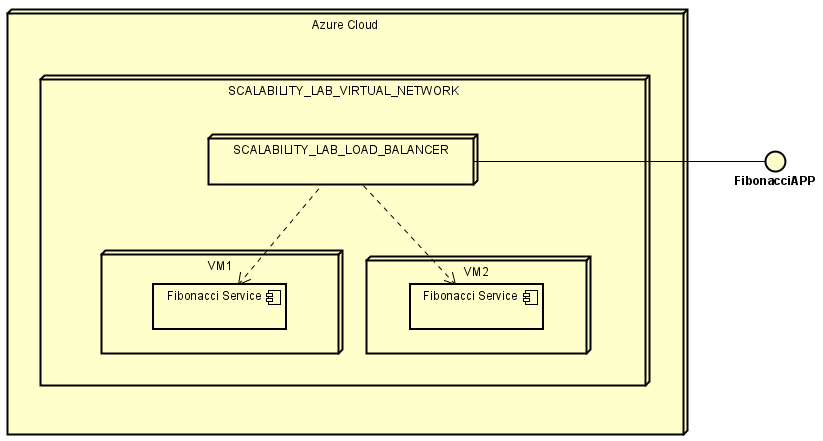


